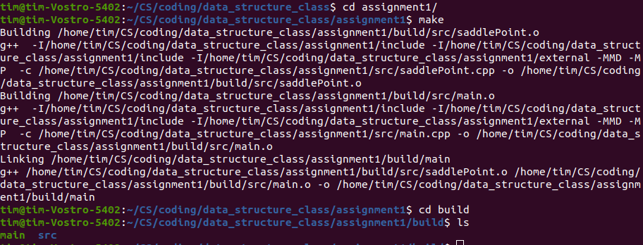
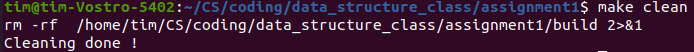
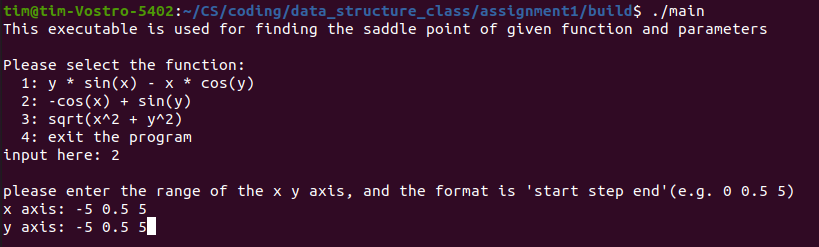
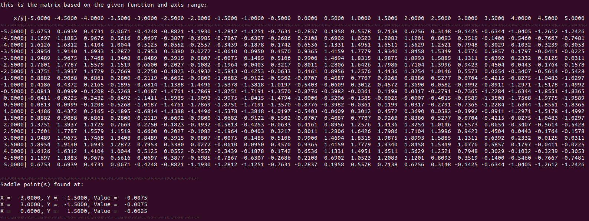
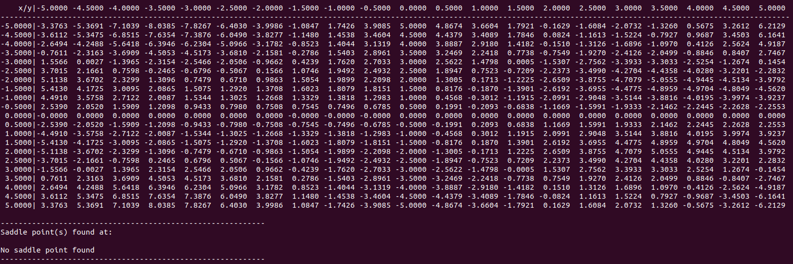
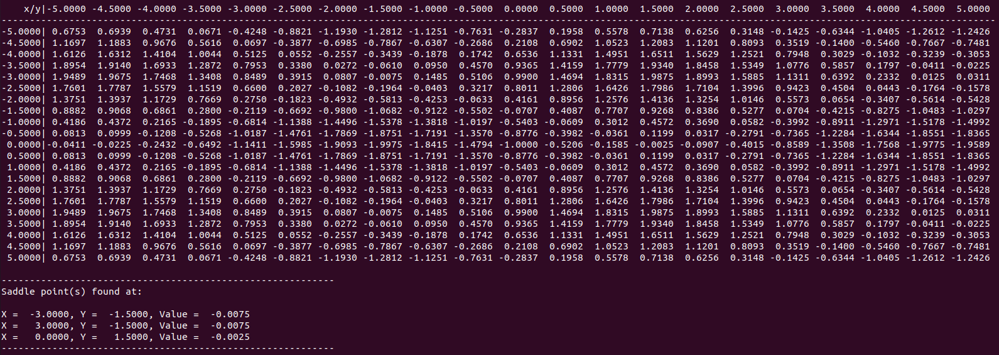
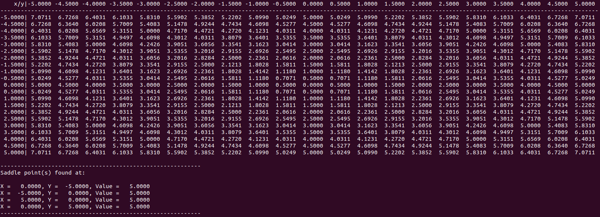

---
Data Structure Class - Assignment 1
student: 洪浩育 
studentId: M113040047
---

# Environment
```
$ uname -a
Linux tim-Vostro-5402 5.15.0-48-generic

$ gcc --version
gcc (Ubuntu 9.4.0-1ubuntu1~20.04.1) 9.4.0

```
# Program
###  * How to build the code
1. `cd assignment1` go to the project folder
2. `make` run make to build the file
3. you will see the executable file "main" in build folder
4. `make clean` delete the build folder



###  * How to run the code
1. `make run / ./build/main` run main in build folder
2. choose the function as the program prompt
3. choose the range of the xAxis
4. choose the range of the yAxis
5. it will output the matrix and all the saddle point
6. `./build/main < test_case > output` this will give you all the saddle points of the three functions(range -5 0.5 5)



# Test Results
### 1. F (X,Y) = Y * sin X – X * cos Y, (-5, 0.5, 5)


### 2. F (X,Y) = -cos X + sin Y


### 3. F (X,Y) = sqrt(X^2 + Y^2)


# Questions for this project
### 1. Describe any challenges you encountered

* This is my first time writing C++. I spend a lot of time tring to understand the syntax of it. Beside of that, c++ provide many useful standard library, so I try to look through some of it and use in this homework.

* Makefile is also a big issue for me. I didn't really know how to use it, so did a lot of research. Finally, I am able to write a basic one, I'm still trying to make it more general, so I can apply it to a bigger project in the future. By the way, there is also one popular build program call CMake that support cross platform build. I'm still trying to walk through some basicc knowledge.

* I'm also trying to understand the testing paradigm of c++. In the next assignment I will try to include the unit test into the assignment.

### 2. What did you learn from this programming

* understand the basic programming of c++ and some of basic standard library

* know how to handle terminal IO in c++

* understand how to use function pointer and enum class

* understand the basic of makefile

* know how the basic matrix work in c++